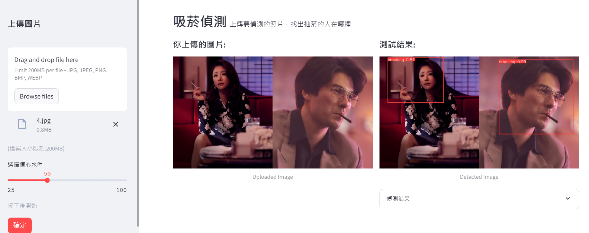

### 吸菸偵測網頁應用程式
這是一個使用 YOLOv8 物體偵測模型進行微調後利用streamlit建立的吸菸偵測網頁應用程式，偵測圖片內的人是否有吸菸的行為。
---
### 連結
在streamlit上執行!
<https://smokingmendetecterapp.streamlit.app/>
---
### 使用說明
1. 上傳影像並偵測吸菸行為
2. 將偵測結果以方框和標籤標示在影像或視訊串流上

